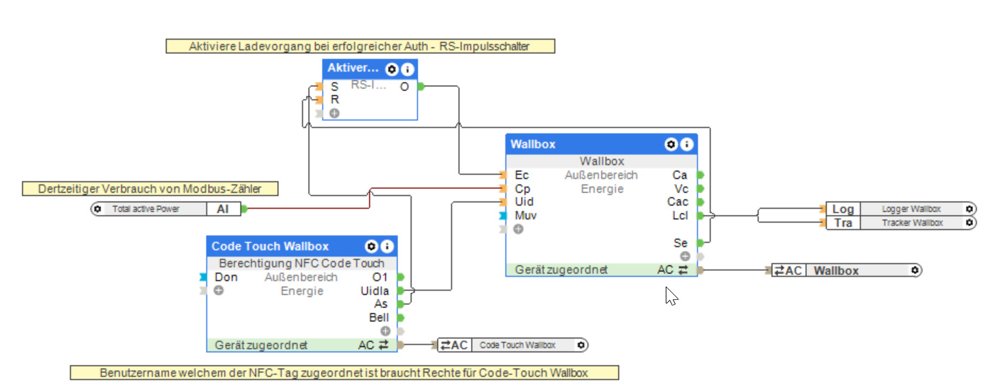

# Loxone Wallbox Reporter

##  Projektbeschreibung
Der **Loxone Wallbox Reporter** dient dazu, die Ladekosten an einer Loxone Wallbox zu erfassen und automatisch für die Abrechnung mit dem österreichischen Arbeitgeber aufzubereiten. Die Anwendung lädt dazu die Ladestatistiken von Loxone Miniserver via  FTP, berechnet die Kosten und sendet die Berichte per E-Mail an eine vordefinierte Adresse.

Die Applikation wurde für die Verwendung mit einer Loxone Wallbox mit einem Modbus-Stromzähler und einem Code-Touch NFC implementiert.

---

## 🔧 Installation

### Installation mit **Docker Compose** und **Dockge** auf Proxmox
Dieses Projekt kann mit **Docker Compose** betrieben werden. Eine einfache Verwaltung ermöglicht **Dockge**.

#### 1️⃣ Dockge auf Proxmox installieren
Dockge kann mit folgendem Skript auf einem **Proxmox-Host** installiert werden:

[Dockge Installations-Skript](https://community-scripts.github.io/ProxmoxVE/scripts?id=dockge)

#### 2️⃣ Docker Compose Datei in Dockge einfügen

Das **compose.yml** befindet sich bereits im Repository und kann direkt in **Dockge** eingefügt werden.

#### 3️⃣ Starten des Containers
Nachdem die **compose.yml** Datei in Dockge eingefügt wurde, kann der Container gestartet werden.

---

## Alternative Installationsvarianten:

- Die **compose.yml** auf beliebigen Docker Host (Linux/Windows) laufen lassen - oder in [Portainer](https://www.portainer.io/) ausführen.
- Die Abhängigkeiten aus der **requirements.yml** installieren und die zwei Python-Scripts in ein Verzeichnis kopieren. Parameter in **wallbox_reporter.py** anpassen. Start mit  python wallbox_reporter.py

---

## 🛠️ Konfiguration
Alle wichtigen Einstellungen werden über **Environment-Variablen** in der `compose.yml` konfiguriert. Beim Einfügen in **Dockge** sind diese bereits vorausgefüllt, müssen aber individuell angepasst werden.

Der Filter User sollte dabei dem Loxone-Benutzer entsprechen (zb. via NFC authentifiziert) welcher die Ladesession authorisiert.

In der Loxone-Konfig aollte am LCL-Ausgang des Wallbox-Baustein ein Logger mit dem `LOGFILE_PATH` als Adresse verbunden werden.



Das Loxone-Benutzerkonto welches via FTP auf den Miniserver zugreift, benötigt das `FTP` Recht.

### **Umgebungsvariablen:**

| Variable            | Beschreibung |
|--------------------|--------------|
| `FTP_SERVER`       | Adresse des Loxone Mini-Servers (z. B. `loxone-miniserver.local`) |
| `FTP_USER`         | Benutzername für den FTP-Login |
| `FTP_PASSWORD`     | Passwort für den FTP-Zugang |
| `FILTER_USER`      | Benutzer-ID, nach der die Ladungslogs gefiltert werden |
| `LICENSE_PLATE`    | Kennzeichen des Fahrzeugs für die Abrechnung |
| `SMTP_SERVER`      | SMTP-Server für den Mailversand |
| `SMTP_PORT`        | Port für den SMTP-Server (Standard: `587`) |
| `SMTP_USE_SSL`     | `True`, falls SSL/TLS verwendet wird, sonst `False` |
| `SMTP_USER`        | SMTP-Benutzername |
| `SMTP_PASSWORD`    | SMTP-Passwort |
| `BILLING_EMAIL`    | Zieladresse für die Abrechnungsmail |
| `ADMIN_EMAIL`      | Administrator-E-Mail für Fehlermeldungen |
| `LOGFILE_PATH`     | Pfad zur Logdatei auf dem FTP-Server |
| `REPORTING_DAY`    | Tag im Monat, an dem die Abrechnung gesendet wird (Standard: `2`) |
| `MONTH_LOOKBACK`   | Monate zurück für die Abrechnung (Standard: `1`) |
| `TZ`               | Zeitzone des Containers (z. B. `Europe/Berlin`) |

---

## 📈 Funktionsweise
1. **Ladelog-Dateien abrufen**: Das Skript lädt die Logdateien vom FTP-Server.
2. **Ladevorgänge filtern & berechnen**: Die Daten werden gefiltert, um nur relevante Ladevorgänge zu erfassen.
3. **PDF-Bericht erstellen**: Ein PDF-Bericht mit den Ladekosten wird erzeugt.
4. **Versand per E-Mail**: Der Bericht wird an die hinterlegte `BILLING_EMAIL` gesendet.

---

## 🔍 Beispiel: Automatische Monatsabrechnung
Jeden Monat am `REPORTING_DAY` (z. B. der **2. des Monats**) wird automatisch eine E-Mail mit der Abrechnung des Vormonats erstellt und versendet.

Als Anhang ist wird eine PDF mit den einzelnen Ladevorgägngen angehängt.

**Beispiel-Mailinhalt:**

```
Betreff: Wallbox Abrechnung [Kennzeichen] - [Monat/Jahr]

Sehr geehrte Damen und Herren,

anbei die Abrechnung für [Monat/Jahr] für das Kennzeichen [Kennzeichen].

Gesamtdauer: X Stunden
Lademenge: Y kWh
Kostenersatz: Z EUR

Mit freundlichen Grüßen
Ihr Wallbox Reporter
```

---

## 🔧 Erste Tests ##

Für erste Tests den `REPORTING_DAY` auf den aktuellen Tag und `MONTH_LOOKBACK` auf `0` setzen um beim nächsten Start des Containers/des Scripts die Prozesslogik auf die Ladelogs des aktuellen Monats zu starten.

---

## 🎉 Mitmachen & Support
Falls du Fehler findest oder neue Features vorschlagen möchtest, erstelle gerne ein Issue oder einen Pull Request im [GitHub-Repository](https://github.com/anlx-sw/loxone-wallbox-reporter).

Viel Erfolg beim Nutzen des **Loxone Wallbox Reporters**! 🏠🚗⚡

